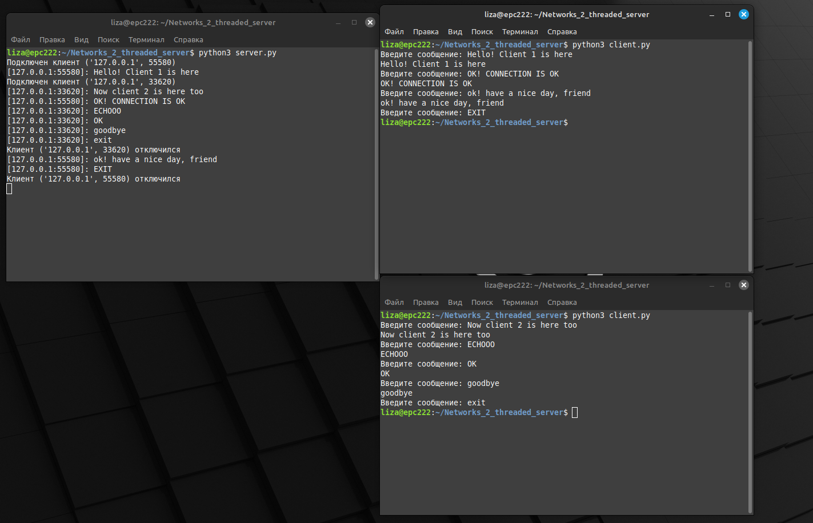

<!----- Conversion time: 0.718 seconds.
Using this Markdown file:

1. Cut and paste this output into your source file.
2. See the notes and action items below regarding this conversion run.
3. Check the rendered output (headings, lists, code blocks, tables) for proper
   formatting and use a linkchecker before you publish this page.

Conversion notes:

* Docs to Markdown version 1.0β17
* Wed Sep 18 2019 01:52:00 GMT-0700 (PDT)
* Source doc: https://docs.google.com/open?id=1SEODmwLcgVdQijJMZ6Xc3YQ0lqnkc72w-gccG4AkpqU
----->

## Создание простого многопоточного сервера

### Цель работы

Познакомиться с приемами работы с многопоточностью на примере создания сокетного TCP-сервера, способного работать с несколькими клиентами одновременно

### Задания для выполнения

1. Создать простой эхо-сервер и клиент для него.
2. Модифицировать код сервера таким образом, чтобы при подключении нового клиента создавался новый поток и вся работа с клиентом выполнялась в нем.
3. Проверить возможность подключения нескольких клиентов к этому серверу одновременно. 

### Результат:

#### Задание выполнено

### Дополнительные задания

1. Реализовать сканер TCP-портов. Программа должна запрашивать имя хоста/IP-адрес у пользователя. Затем программа должна пробовать подключиться к этому хосту ко всем портами по очереди. При успешном подключении программа должна выводить в консоль сообщение “Порт N открыт”. 
    1. Модифицировать эту программу, чтобы сканирование портов происходило параллельно. Для этого нужно распараллелить сканирование портов по нескольким потокам. 
    2. Обеспечить вывод списка открытых портов по порядку.
    3. Реализовать progress bar в командной строке, показывающий прогресс сканирования.

<!-- Docs to Markdown version 1.0β17 -->